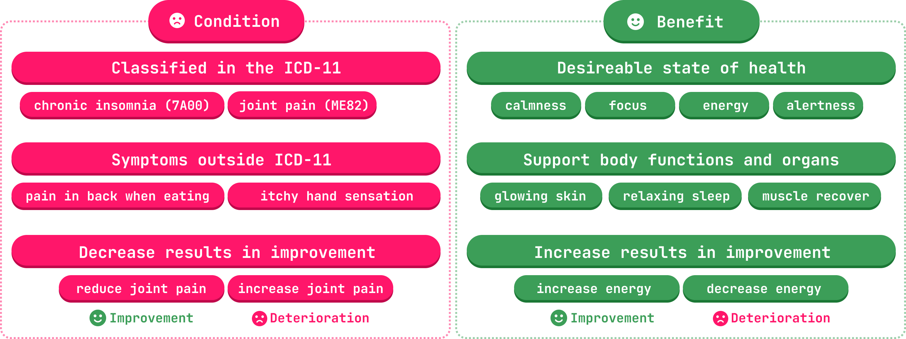
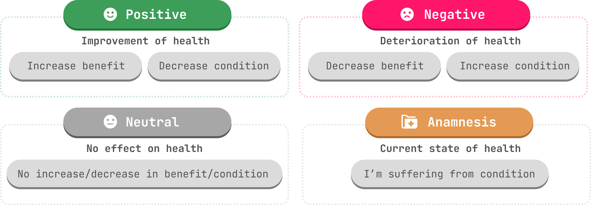

# Welcome to Healthsea ✨
## Create better access to health with spaCy. 
Healthsea is a pipeline for analyzing user reviews to supplement products by extracting their effects on health. 

> Learn more about Healthsea in our [blog post](https://explosion.ai/blog/healthsea)!


## 💉 Creating better access to health
Healthsea aims to analyze user-written reviews of supplements in relation to their effects on health. Based on this analysis, we try to provide product recommendations.
For many people, supplements are an addition to maintaining health and achieving personal goals. Due to their rising popularity, consumers have increasing access to a variety of products.

However, it's likely that most of the products on the market are redundant or produced in a "quantity over quality" fashion to maximize profit. The resulting white noise of products makes it hard to find the right supplements. 

**Healthsea automizes the analysis and provides information in a more digestible way.** ✨

---

## 🟢 Requirements

To run this project you need:
```
spacy>=3.2.0
benepar>=0.2.0
torch>=1.6.0
spacy-transformers>=1.1.2
```
You can install them in the project folder via `spacy project run install`

## 📖 Documentation

| Documentation              |                                                                |
| -------------------------- | -------------------------------------------------------------- |
| 🧭 **Usage**      | How to use the pipeline               |
| ⚙️ **Pipeline**      | Learn more about the architecture of the pipeline               |
| 🪐 **spaCy project**      | Introduction to the spaCy project               |
| ✨ **Demos**                | Introduction to the Healthsea demos              |

## 🧭 Usage

The pipeline processes reviews to supplements and returns health effects for every found health aspect. 

You can either train the pipeline yourself with the provided datasets in the spaCy project or directly download the trained Healthsea pipeline from Huggingface via 
`pip install https://huggingface.co/explosion/en_healthsea/resolve/main/en_healthsea-any-py3-none-any.whl`

```
import spacy

nlp = spacy.load("en_healthsea")
doc = nlp("This is great for joint pain.")

# Clause Segmentation & Blinding
print(doc._.clauses)

>     {
>    "split_indices": [
>        0,
>        7
>    ],
>    "has_ent": true,
>    "ent_indices": [
>        4,
>        6
>    ],
>    "blinder": "<CONDITION>",
>    "ent_name": "joint pain",
>    "cats": {
>        "POSITIVE": 0.9824668169021606,
>        "NEUTRAL": 0.017364952713251114,
>        "NEGATIVE": 0.00002889777533710003,
>        "ANAMNESIS": 0.0001394189748680219
>    },
>    "prediction_text": [
>        "This",
>        "is",
>        "great",
>        "for",
>        "<CONDITION>",
>        "!"
>    ]
>    }

# Aggregated results
print(doc._.health_effects)

>    {
>    "joint_pain": {
>        "effects": [
>        "POSITIVE"
>        ],
>        "effect": "POSITIVE",
>        "label": "CONDITION",
>        "text": "joint pain"
>       }
>    }

```

---

## ⚙️ Pipeline

The pipeline consists of the following components:
```
pipeline = [sentencizer, tok2vec, ner, benepar, segmentation, clausecat, aggregation]
```

It uses Named Entity Recognition to detect two types of entities ```Condition``` and ```Benefit```.

 ```Condition``` entities are defined as health aspects that are improved by decreasing them. They include diseases, symptoms and general health problems (e.g. pain in back). ```Benefit``` entities on the other hand, are desired states of health (muscle recovery, glowing skin) that improve by increasing them.



The pipeline uses a modified model that performs Clause Segmentation based on the [benepar parser](https://github.com/nikitakit/self-attentive-parser), Entity Blinding and Text Classification. It predicts four exclusive effects: `Positive, Negative, Neutral, and Anamnesis`.



---

## 🪐 spaCy project
The ```project``` folder contains a [spaCy project](https://spacy.io/usage/projects) with all the training data and workflows.

Use ```spacy project run``` inside the project folder to get an overview of all commands and assets. For more detailed documentation, visit the [project folders readme](https://github.com/thomashacker/healthsea/tree/main/project). 

Use ```spacy project run install``` to install dependencies needed for the pipeline.

## ✨ Demo

### Healthsea Demo
A `demo` for exploring the results of Healthsea on real data can be found at [Hugging Face Spaces](https://huggingface.co/spaces/spacy/healthsea-demo).

### Healthsea Pipeline
A `demo` for exploring the Healthsea pipeline with its individual processing steps can be found at [Hugging Face Spaces](https://huggingface.co/spaces/spacy/healthsea-pipeline).


