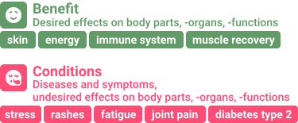

# Training assets

The assets folder holds all training and development data for developing the Named Entity Recognition (NER) and Text Classification (Textcat) model. For more information about the annotation guidelines, visit the [healthsea blog post]().

## Named Entity Recognition

### 5060 examples 
 without entities

 with entities

| Label | Description | Examples |
| --- | --- | --- | 
| Condition | Diseases, symptoms, problems specified to body region, -organ, and -function | joint pain, diabetes, digestion issues |
| Benefit | Desireable states of health, body region, -organ, and -function | energy, sleep, muscle recovery, skin |

### Label distribution

| Label | Total | Unique | Percentage |
| --- | --- | --- | --- | 
| Condition | 1712 | 715 |  | 
| Benefit | 1252 | 282 |  | 
|  | 2964 | 997 |  | 

## Text Classification

### 4979 examples

| Label | Description | Examples |
| --- | --- | --- | 
| Positive | Improvement of health | Increased benefit, decreases condition, improved benefit/condition |
| Negative | Deterioration of health | Decreased benefit, increased condition, made benefit/condition worse |
| Neutral | No effect on health | Not increased benefit, not decreased condition, no effect on benefit/condition |
| Anamnesis | Current state of health | Diagnosed with condition/benefit, suffering from condition/benefit |

### Class distribution

| Class | Total | Percentage |
| --- | --- | --- |
| Positive | 2006 |  |
| Negative | 291 |  | 
| Neutral | 2268 |  | 
| Anamnesis | 414 |  |
|  | 4979 |  |
